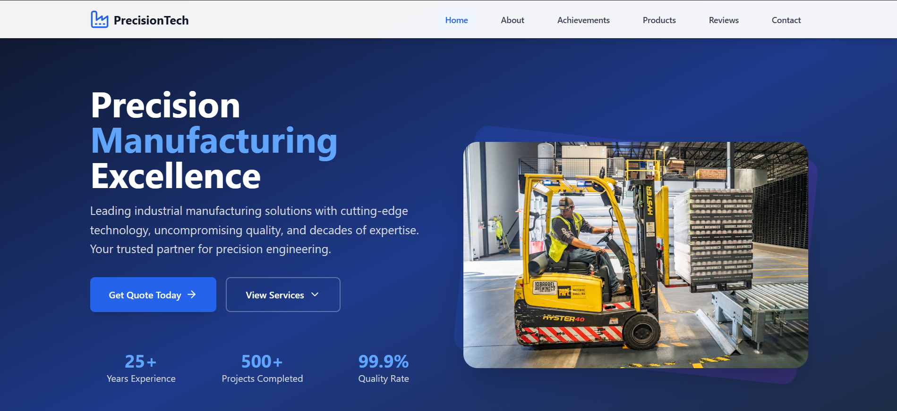
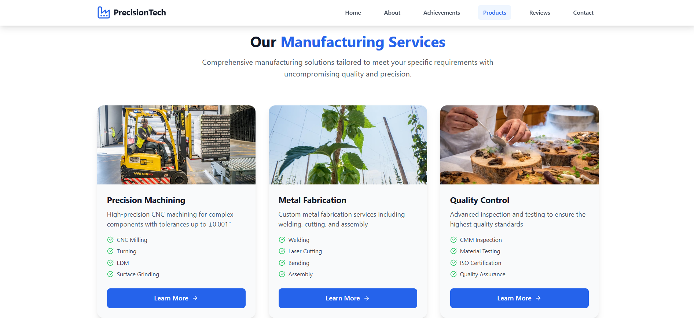
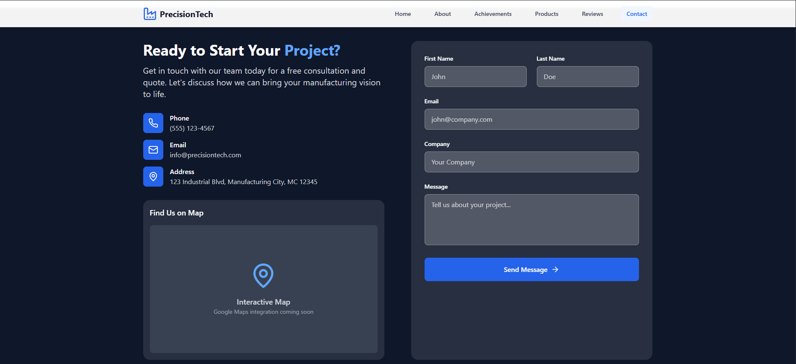

# ⚙️ Industrial Company Website

A modern, responsive, and professional website built for industrial businesses. This website is designed to showcase products, certifications, client testimonials, and a strong company presence with integrated maps, reviews, and social media.



---

## 🌐 Live Demo

🔗 [View Live Site](https://your-demo-link.com)

---

## 🚀 Features

- ✅ Smooth scrolling navigation across all sections  
- 🧲 Hero section with CTA buttons and compelling tagline  
- 🛠️ Services showcase with hover effects  
- 📜 About section with certifications & differentiators  
- 🗣️ Client testimonials with star ratings  
- 🏆 Achievements section (ISO certifications, awards)  
- 📍 Integrated Google Maps for location  
- 💬 Google-style review cards  
- 🔗 Social media links (Facebook, Twitter, LinkedIn, YouTube, Instagram)  
- 📱 Mobile-responsive layout with animations  
- ✨ Clean, modern UI with professional color palette  

---

## 🛠️ Tech Stack

- **Frontend**: React + TypeScript  
- **Styling**: Tailwind CSS  
- **Animations**: Framer Motion  
- **Icons**: Lucide React  
- **Maps**: Google Maps Embed API  

---

## 📸 Screenshots

| Achievements Section | Services | Contact + Map |
|----------------------|----------|---------------|
|  |  |  |

---

## 🧑‍💻 Getting Started

### Prerequisites
Make sure you have [Node.js](https://nodejs.org/) installed (v16+ recommended).

### Installation

```bash
# Clone the repository
git clone https://github.com/your-username/industrial-site.git

# Navigate into the directory
cd industrial-site

# Install dependencies
npm install

# Start the development server
npm run dev
